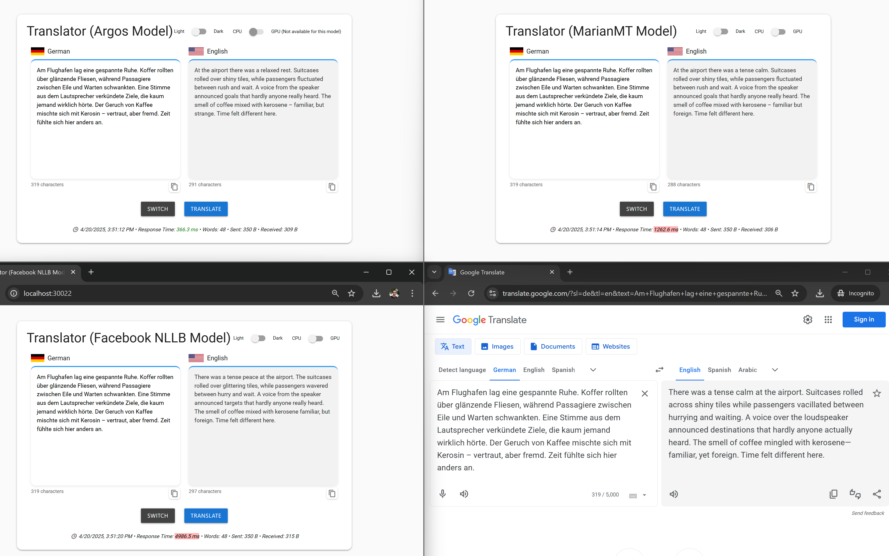

# MarianMT Translator German ↔ English

Simple REST API for German ↔ English translation using Hugging Face MarianMT models.

## Model Comparisons

| Repository                                                                                    | Speed                                  | Translation Quality | Notes                                         |
|-----------------------------------------------------------------------------------------------|----------------------------------------|---------------------|-----------------------------------------------|
| [facebook-nllb-translator-api-py](https://github.com/jmaycon/facebook-nllb-translator-api-py) | 🚶‍♂️ Slowest                          | ✅ Best              | Accurate translations, but slower performance |
| [marian-translator-api-py](https://github.com/jmaycon/marian-translator-api-py)               | 🏃 Faster than NLLB, slower than Argos | 👍 Good             | Balanced between quality and speed            |
| [argos-translator-api-py](https://github.com/jmaycon/argos-translator-api-py)                 | ⚡ Fastest                              | ⚠️ Lower            | Extremely fast but less accurate              |


---

## Run

### Option 1: Run with Docker 🐳

UI: http://localhost:30010/

```shell
docker build -t marian-translator-api-py .
docker run --rm -p 30010:8080 marian-translator-api 
```

### Option 2: On Linux

UI: http://localhost:30011/

```shell
chmod +x run_local.sh
./run_local.sh
```

### Option 3: On Windows (PowerShell)

UI: http://localhost:30012/

```shell
./run_local.ps1
```

---

## 🔁 API Usage

To check if CUDA is available run

```shell
source venv/bin/activate
python -c "import torch; print(torch.cuda.is_available())"
```
_For powershell use `.\win-venv\Scripts\Activate.ps1`_

### POST `/translate-<cpu|gpu>`

Translate text between German and English.

`direction` options:

- `"de-en"` = German → English
- `"en-de"` = English → German

#### Sample Request (with curl)

1.German to English

```shell
curl -X POST http://localhost:30010/translate-cpu \
      -H "Content-Type: application/json" \
      -d '{"text": "Guten Morgen", "direction": "de-en"}'
```

- 2.English to German

```shell
curl -X POST http://localhost:30010/translate-cpu \
      -H "Content-Type: application/json" \
      -d '{"text": "Hi my friend", "direction": "en-de"}'
```

#### Sample Response

```json
{
  "translation": "Good morning"
}
```
---

## 🧩 Models Used

- https://huggingface.co/Helsinki-NLP/opus-mt-de-en
- https://huggingface.co/Helsinki-NLP/opus-mt-en-de


